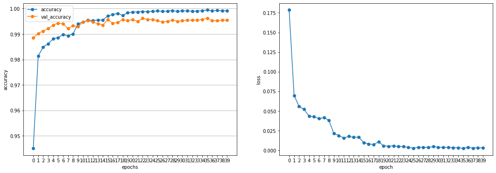
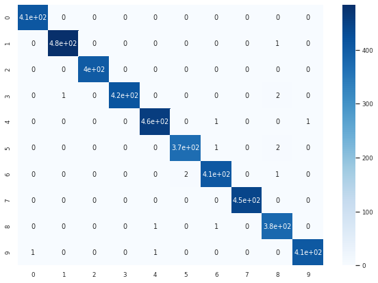

# Digit_Recognition

## Description: Kaggle Digit Recognizer Competition

### Process: use Keras sequential model to build a CNN and train it on MNIST

### Skills used: CNN, data augmentation, learning rate schedule

### Best test accuracy: 0.99614, ≈ top 11%

### Sample images

